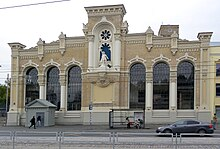

# Tutorial Mikrotik Lengkap
#
#### Pilih bahasa.

- [[Indonesia](language/ind/README.md)]
- [[English](lenguage/eng/README.md)]

## 1. Pendahuluan
Mikrotik adalah perusahaan yang bergerak pada perangkat jaringan berasal dari Latvia.
Didirikan pada 14 Maret, 1996 dengan CEO Jhon Tully. Mengembangkan dan menjual perangkat lunak, perangkat keras 
seperti router, switch jaringan, Access Point, dan sistem operasi dan perangkat lunak lainnya.

  
Kantor pusat Mikrotik di Riga.

Untuk informasi seputar Mikrotik seperti website, forum, wiki.  
**Website** : https://mikrotik.com/  
**Wiki** : https://wiki.mikrotik.com/wiki/Main_Page  
**Forum** : https://forum.mikrotik.com/  
**Twitter** :   
**Facebook** :   
**Youtube** :   

